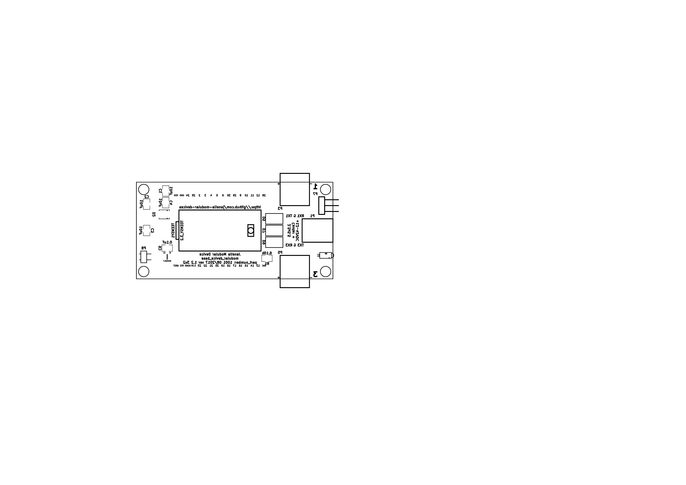
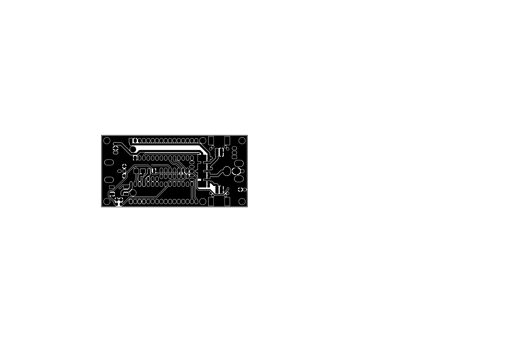
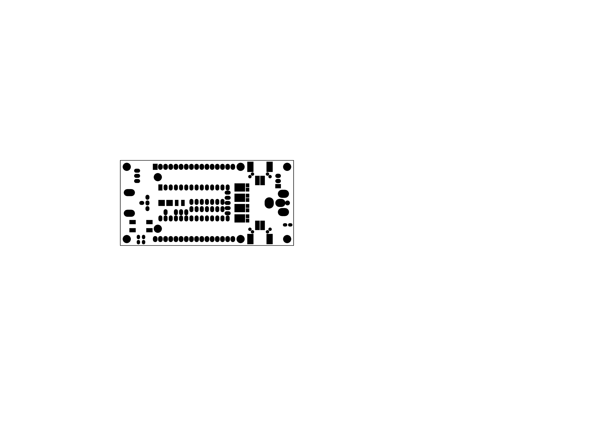
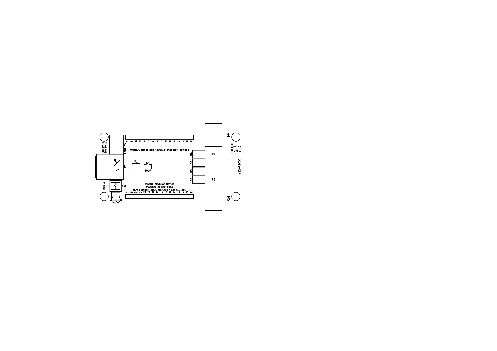

- [Repository Information](#org47d54bf)
- [Schematic](#org4be667a)
- [Gerbers](#org12de3a4)
- [Bill of Materials](#org0e74e04)

# Repository Information

-   **Title:** modular\_device\_base\_3x2
-   **Author:** Peter Polidoro
-   **Email:** peterpolidoro@gmail.com
-   **License:** Open-Source Hardware

# Schematic

# Gerbers

Save gerber files and send to your favorite PCB manufacturer.

[modular\_device\_base\_3x2\_v1.2](./gerbers/modular_device_base_3x2_v1.2.zip)

     

# Bill of Materials

./bom/bom\_pcb\_add.csv ./bom/bom\_pcb.csv ./bom/digikey\_order.csv ./bom/digikey\_order\_pcb\_add.csv ./bom/digikey\_order\_pcb.csv
