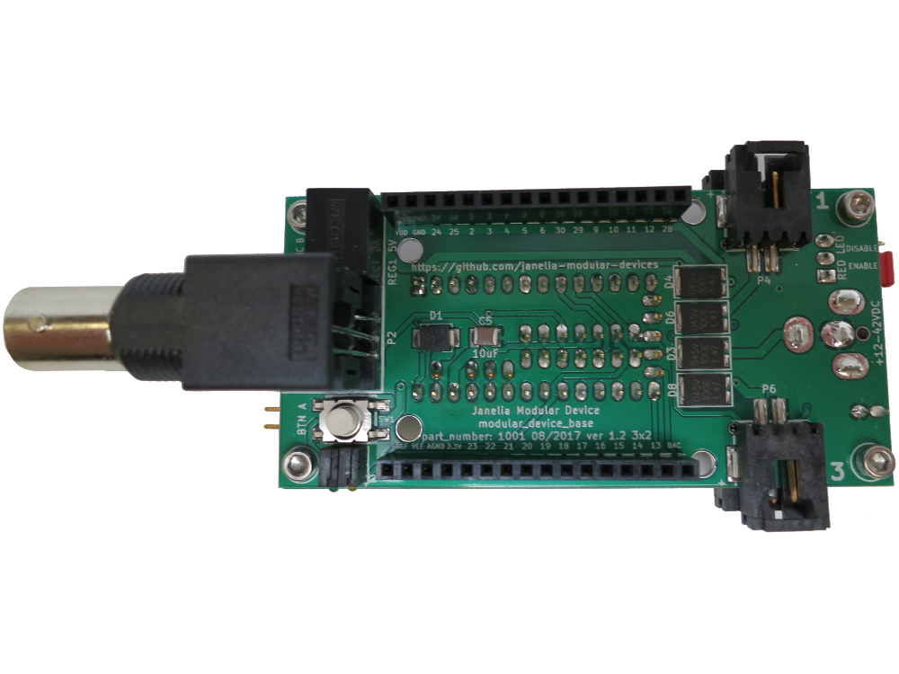
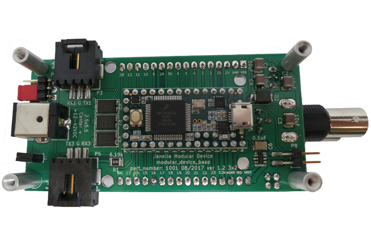
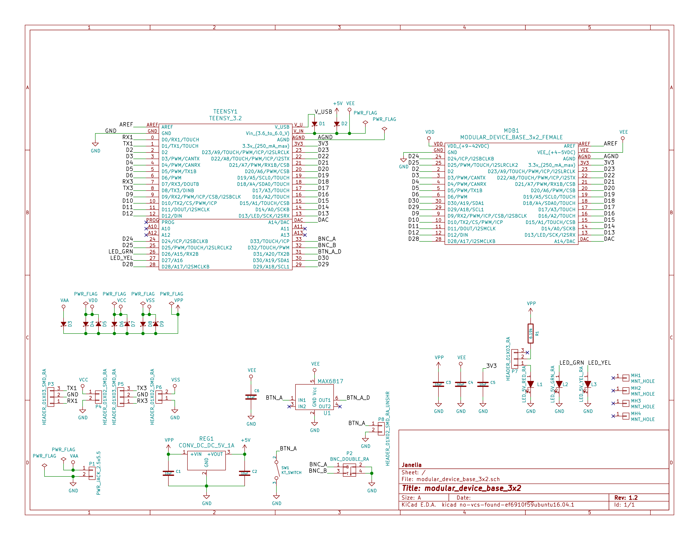
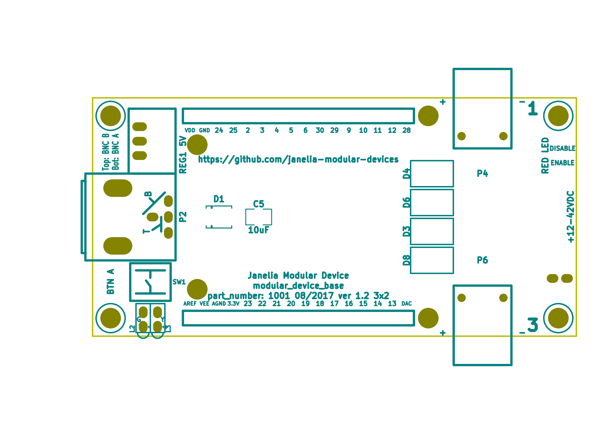
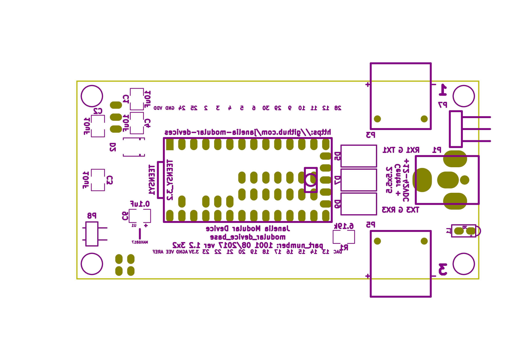

- [Repository Information](#org45b2831)
  - [Description](#org88f7ef7)
- [Images](#orgbd037cb)
- [Schematic](#orgd6d4fe1)
- [Gerbers](#org38a6fae)
- [Bill of Materials](#org89b3aa4)
  - [PCB Parts](#org8937486)
  - [Additional Parts](#org1fbaf21)
  - [Vendor Parts Lists](#org2ee80bc)

# Repository Information

-   **Name:** modular\_device\_base\_3x2
-   **Version:** 1.2
-   **License:** Open-Source Hardware
-   **Author:** Peter Polidoro
-   **Email:** peterpolidoro@gmail.com

## Description

This board is the base of 3x2 format modular devices. It is a breakout board for the microprocessor, with connections for power, communication, and top boards.

# Images

# Schematic

[./schematic/modular\_device\_base\_3x2.pdf](./schematic/modular_device_base_3x2.pdf)

# Gerbers

Save gerbers zip file and send to your favorite PCB manufacturer for fabrication.

[./gerbers/\*.zip](./gerbers/*.zip)

# Bill of Materials

## PCB Parts

[./bom/bom\_pcb.csv](./bom/bom_pcb.csv)

| Item | Reference(s)         | Value                              | Quantity | Description                                           | PartNumber          | Vendor  |
| 1    | C1 C2 C3 C4 C5       | 10uF                               | 5        | CAP CER 10UF 50V 10% X7S 1210                         | 445-4536-1-ND       | digikey |
| 2    | C6                   | 0.1uF                              | 1        | CAP CER 0.1UF 100V X7R 1210                           | 399-13229-1-ND      | digikey |
| 3    | D1 D2                | diode\_schottky\_15V\_1A           | 2        | DIODE SCHOTTKY 15V 1A DO214BA                         | LSM115JE3/TR13CT-ND | digikey |
| 4    | D3 D4 D5 D6 D7 D8 D9 | diode\_schottky\_45V\_10A          | 7        | DIODE SCHOTTKY 45V 10A CFP15                          | 568-11697-1-ND      | digikey |
| 5    | L1                   | LED\_5V\_RED\_RA                   | 1        | LED 2MM 5V RT ANGLE RED PCMNT                         | 350-1712-ND         | digikey |
| 6    | L2                   | LED\_5V\_GRN\_RA                   | 1        | LED 2MM 5V RT ANGLE GREEN PCMNT                       | 350-1717-ND         | digikey |
| 7    | L3                   | LED\_5V\_YEL\_RA                   | 1        | LED 2MM 5V RT ANGLE YELLOW PCMNT                      | 350-1719-ND         | digikey |
| 8    | MDB1                 | MODULAR\_DEVICE\_BASE\_3x2\_FEMALE | 2        | 16 Position Header Through Hole Female Socket         | S7049-ND            | digikey |
| 9    | MH1 MH2 MH3 MH4      | MNT\_HOLE                          | 4        | Round Standoff Threaded 4-40 Aluminum 0.500in 0.187in | 36-2027-ND          | digikey |
| 10   | P1                   | PWR\_JACK\_2.5x5.5                 | 1        | CONN PWR JACK DC 2.5X5.5 8A T/H                       | CP-063BH-ND         | digikey |
| 11   | P2                   | BNC\_DOUBLE\_RA                    | 1        | CONN BNC JACK R/A 75 OHM PCB                          | ACX1655-ND          | digikey |
| 12   | P3 P5                | HEADER\_01X03\_SMD\_RA             | 2        | CONN HEADER 3POS R/A SMD GOLD                         | A100890CT-ND        | digikey |
| 13   | P4 P6                | HEADER\_01X02\_SMD\_RA             | 2        | CONN HEADER 2POS R/A SMD GOLD                         | A100903CT-ND        | digikey |
| 14   | P7                   | HEADER\_01X03\_RA                  | 1        | CONN HEADER 3 POS RA 2.54                             | 732-5336-ND         | digikey |
| 15   | P8                   | HEADER\_01X02\_SMD\_RA\_UNSHR      | 1        | CONN HEADER 2POS .100in SNGL SMD                      | SAM10781-ND         | digikey |
| 16   | R1                   | 6.19k                              | 1        | RES SMD 6.19K OHM 1% 1/2W 1210                        | P6.19KAACT-ND       | digikey |
| 17   | REG1                 | CONV\_DC\_DC\_5V\_1A               | 1        | CONV DC/DC 1A 5V OUT SIP VERT                         | 945-1395-5-ND       | digikey |
| 18   | SW1                  | KT\_SWITCH                         | 1        | SWITCH TACTILE SPST-NO 1VA 32V                        | CKN1860CT-ND        | digikey |
| 19   | TEENSY1              | TEENSY\_3.2                        | 1        | DEV TEENSY 3.2 13736                                  | 1568-1231-ND        | digikey |
| 20   | U1                   | MAX6817                            | 1        | IC DEBOUNCER SWITCH DUAL SOT23-6                      | MAX6817EUT+TCT-ND   | digikey |

## Additional Parts

[./bom/bom\_pcb\_add.csv](./bom/bom_pcb_add.csv)

| Item | Function   | Quantity | Description                                                              | PartNumber    | Vendor  |
|---- |---------- |-------- |------------------------------------------------------------------------ |------------- |------- |
| 1    | POWER      | 1        | AC/DC DESKTOP ADAPTER 24V 90W                                            | 62-1187-ND    | digikey |
| 2    | POWER      | 1        | 30 WATT DESKTOP POWER SUPPLY 24V                                         | EPS594-ND     | digikey |
| 3    | POWER      | 1        | CORD 3COND NEMA PLUG 320-C5                                              | 993-1037-ND   | digikey |
| 4    | CONNECTORS | 1        | 14 Positions Header Unshrouded Breakaway Connector 0.100in 2 row SMD     | A106625CT-ND  | digikey |
| 5    | CONNECTORS | 2        | 24 Positions Header Unshrouded Breakaway Connector 0.100in 1 row Through | S1011EC-24-ND | digikey |
| 6    | CONNECTORS | 1        | CONN JUMPER SHORTING GOLD FLASH                                          | S9001-ND      | digikey |
| 7    | CABLE      | 1        | CABLE USB-A TO MICRO USB-B 2M                                            | AE10342-ND    | digikey |

## Vendor Parts Lists

[./bom/digikey\_order.csv](./bom/digikey_order.csv)

[./bom/digikey\_order\_pcb.csv](./bom/digikey_order_pcb.csv)

[./bom/digikey\_order\_pcb\_add.csv](./bom/digikey_order_pcb_add.csv)
