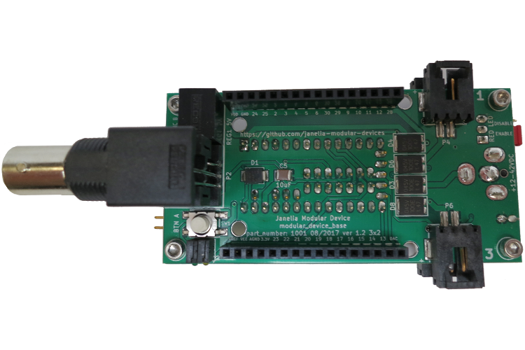

- [Repository Information](#org944d983)
- [Images](#org71a4883)
- [Schematic](#org7c3de7a)
- [Gerbers](#org0de8cff)
- [Bill of Materials](#org17c19fc)

# Repository Information

-   **Title:** modular\_device\_base\_3x2
-   **Author:** Peter Polidoro
-   **Email:** peterpolidoro@gmail.com
-   **License:** Open-Source Hardware

# Images

# Schematic

[modular\_device\_base\_3x2.pdf](./schematic/modular_device_base_3x2.pdf)

# Gerbers

Save gerbers zip file and send to your favorite PCB manufacturer for fabrication.

[modular\_device\_base\_3x2\_v1.2.zip](./gerbers/modular_device_base_3x2_v1.2.zip)

# Bill of Materials

./bom/bom\_pcb\_add.csv ./bom/bom\_pcb.csv ./bom/digikey\_order.csv ./bom/digikey\_order\_pcb\_add.csv ./bom/digikey\_order\_pcb.csv
